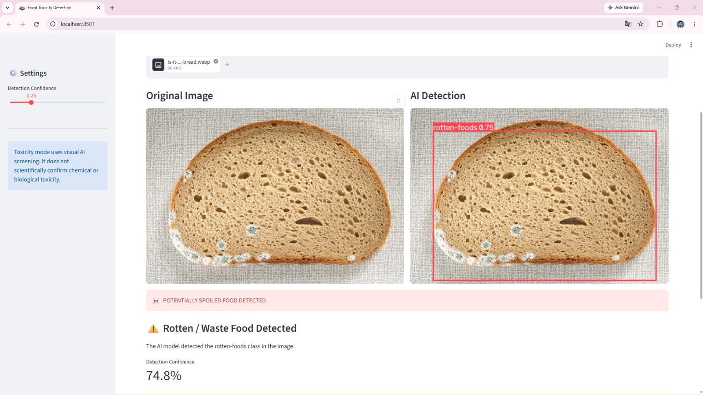
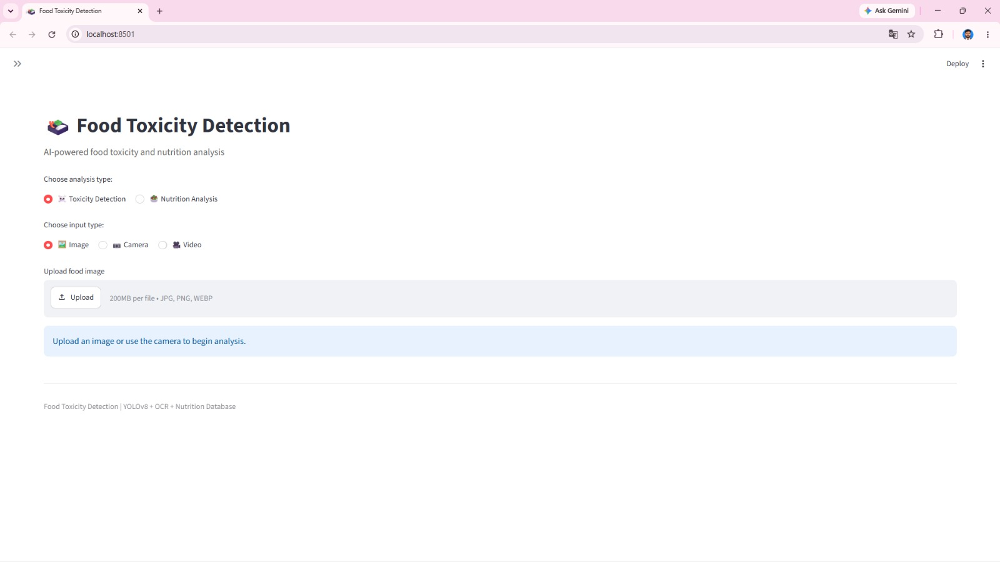
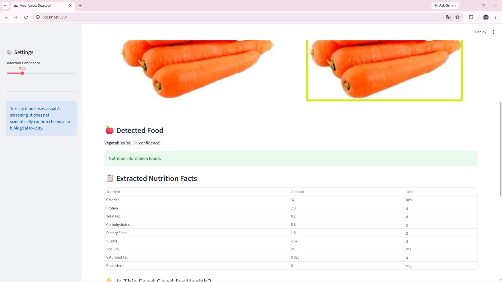

# 🍎 Food Toxicity Detection

> **Visual Food Condition Screening Using Computer Vision & Deep Learning**
>
> An end-to-end computer vision prototype for visually screening food images and identifying multiple food categories, including rotten-foods, using YOLOv8 object detection and an interactive Streamlit application.

---

<p align="center">


</p>

---

> ⚠️ **Important:** This project performs **visual food-condition screening only**. It does not chemically or microbiologically test food for toxins.

---

# 📑 Table of Contents

- [Project Overview](#-project-overview)
- [Problem Statement](#-problem-statement)
- [Project Objectives](#-project-objectives)
- [Our Solution](#-our-solution)
- [Key Features](#-key-features)
- [Dataset](#-dataset)
- [Model Development](#-model-development)
- [System Workflow](#-system-workflow)
- [Technology Stack](#-technology-stack)
- [Project Architecture](#-project-architecture)
- [Model Evaluation](#-model-evaluation)
- [Streamlit Application](#-streamlit-application)
- [Project Screenshots](#-project-screenshots)
- [Results & Limitations](#-results--limitations)
- [Future Scope](#-future-scope)
- [Project Takeaway](#-project-takeaway)
- [Project Team](#-project-team)
- [License](#-license)

---

# 🍎 Project Overview

**Food Toxicity Detection** is an end-to-end **computer vision and deep learning prototype** designed for visual food-condition screening.

The system analyzes food images using **YOLOv8 object detection** to identify multiple food categories and visually detectable spoilage indicators.

A trained `best.pt` model is integrated into an interactive **Streamlit application**, allowing users to upload images or capture images through a camera and receive detection results.

### The system provides:

- Food object detection
- Class identification
- Confidence scores
- Bounding boxes
- Interactive image-based screening
- Multi-class food recognition
- Visual spoilage indication

The project also investigates the impact of **class imbalance**, data augmentation, and oversampling on object-detection performance.

---

# 🚩 Problem Statement

Manual visual inspection of food can become time-consuming when a large number of images need to be screened.

Food images can also vary significantly because of:

- Lighting conditions
- Backgrounds
- Food appearance
- Object size
- Image quality
- Uneven class representation

### Major Challenges

- 🔍 Time-consuming manual inspection
- 💡 Significant lighting variation
- 🖼️ Different backgrounds and object sizes
- 🍎 Variation in food appearance
- ⚖️ Class imbalance
- 📉 Difficulty detecting minority categories
- 🦠 Limited representation of rotten-food examples

The project specifically studies how **class imbalance affects food-object detection performance**.

---

# 🎯 Project Objectives

The project focuses on six major development objectives.

### 01. Develop

Build a YOLOv8-based food object detection prototype.

### 02. Detect

Identify multiple food categories, including rotten-foods.

### 03. Analyze

Study the impact of class imbalance on detection performance.

### 04. Experiment

Compare:

- Original dataset baseline
- Data augmentation
- Augmentation with oversampling

### 05. Evaluate

Measure model performance using:

- Precision
- Recall
- mAP@50
- mAP@50–95

### 06. Integrate

Integrate the trained `best.pt` model into a Streamlit application.

---

# 💡 Our Solution

The project combines **computer vision, deep learning, dataset analysis, and an interactive application**.

### Core Components

```text
Food Image
     │
     ▼
Image Processing
     │
     ▼
YOLOv8 Object Detection
     │
     ▼
Trained best.pt Model
     │
     ▼
Detection Results
     │
     ├── Class Label
     ├── Confidence Score
     └── Bounding Box
     │
     ▼
Streamlit Application
```

The system provides an interactive workflow for visually screening food images and displaying detected objects and their confidence scores.

---

# 🚀 Key Features

## 🤖 YOLOv8 Object Detection

A lightweight **YOLOv8n** model is used for food-object detection.

The model generates:

- Class labels
- Confidence scores
- Bounding boxes

---

## 🍎 Multi-Class Food Detection

The project supports eight dataset categories:

| # | Food Category |
|---|---|
| 01 | Bones |
| 02 | Bunched-foods |
| 03 | Eggs |
| 04 | Fish |
| 05 | Fruits |
| 06 | Meats |
| 07 | Rotten-foods |
| 08 | Vegetables |


---

## ⚖️ Class Imbalance Analysis

The project analyzes the effect of uneven class representation on model learning.

Majority classes have more examples available for learning visual patterns, while minority categories may be more difficult for the model to detect robustly.

The project compares different strategies to address this challenge.

---

## 🔄 Data Augmentation

Image augmentation is used to introduce additional visual variation and improve model robustness.

---

## 📊 Oversampling

Oversampling is used to increase representation of minority classes and compare performance against the original baseline and augmentation approaches.

---

## 🌐 Streamlit Application

The trained model is integrated into an interactive Streamlit interface.

Users can:

- Upload an image
- Capture an image through a camera
- Run object detection
- View detected food categories
- View confidence scores
- View bounding boxes


---

# 📊 Dataset

The project uses the **Roboflow Food Waste Detection dataset** in YOLOv8 format.

### Dataset Distribution

| Dataset | Images |
|---|---:|
| Training | 9,840 |
| Validation | 685 |
| Testing | 478 |
| Test Instances | 866 |

### Classes

```text
bones
bunched-foods
eggs
fish
fruits
meats
rotten-foods
vegetables
```

The original test set was kept **untouched for final evaluation**.

---

# 🧪 Model Development

The model development process followed three major experimental stages.

## 01. Baseline

**YOLOv8n + Original Dataset**

The baseline experiment established the initial reference performance.

---

## 02. Augmentation

**YOLOv8n + Additional Image Variation**

Additional visual variation was introduced to improve robustness.

---

## 03. Augmentation + Oversampling

**YOLOv8n + Augmentation + Minority-Class Oversampling**

This experiment increased representation of minority classes and compared the resulting performance against the baseline.

### Final Evaluation Configuration

```text
Model       : YOLOv8n
Image Size  : 416
Batch Size  : 8
GPU Device  : 0
Test Set    : Original untouched test set
```


---

# 🔄 System Workflow

```text
                  USER
                   │
          ┌────────┴────────┐
          │                 │
          ▼                 ▼
     Image Upload       Camera Input
          │                 │
          └────────┬────────┘
                   │
                   ▼
          ┌─────────────────┐
          │    Streamlit    │
          │     Input       │
          └────────┬────────┘
                   │
                   ▼
          ┌─────────────────┐
          │ YOLOv8 Inference│
          └────────┬────────┘
                   │
                   ▼
              ┌─────────┐
              │ best.pt │
              └────┬────┘
                   │
                   ▼
          ┌─────────────────┐
          │ Detection Output│
          └────────┬────────┘
                   │
          ┌────────┼────────┐
          │        │        │
          ▼        ▼        ▼
       Class   Confidence  Bounding
       Label      Score      Box
          │        │        │
          └────────┼────────┘
                   │
                   ▼
            Streamlit UI
```

---

# 🛠 Technology Stack

### Programming

- Python

### Computer Vision

- YOLOv8
- Ultralytics

### Deep Learning

- PyTorch

### Image Processing

- PIL

### Application

- Streamlit

### Development

- Jupyter Notebook
- VS Code

### GPU Acceleration

- CUDA
- NVIDIA RTX 3050

The project presentation identifies these technologies as the primary development and inference environment.

---

# 🏗 Project Architecture

```text
                       USER
                        │
              ┌─────────┴─────────┐
              │                   │
              ▼                   ▼
        Upload Image        Camera Capture
              │                   │
              └─────────┬─────────┘
                        ▼
               Streamlit Application
                        │
                        ▼
                 YOLOv8 Inference
                        │
                        ▼
                     best.pt
                        │
                        ▼
                Detection Engine
                        │
             ┌──────────┼──────────┐
             ▼          ▼          ▼
          Class      Confidence  Bounding
          Label        Score        Box
             │          │          │
             └──────────┼──────────┘
                        ▼
                  Result in UI
```

---

# 📈 Model Evaluation

The project uses standard object-detection metrics to evaluate model performance.

## Precision

Measures how many predicted detections were correct.

## Recall

Measures how many relevant objects were successfully detected.

## mAP@50

Mean Average Precision at an IoU threshold of **0.50**.

## mAP@50–95

Average precision across multiple IoU thresholds.

### Final Test Set

```text
Images       : 478
Instances    : 866
Test Set     : Original untouched test set
```

### Diagnostics

The project uses:

- Confusion matrix
- Precision/recall curves
- PR curves
- Per-class metrics

Performance was limited, particularly for underrepresented classes.

---

# 🌐 Streamlit Application

The trained model is connected to a Streamlit-based interactive application.

## 📤 Image Upload

Users can upload:

- JPG
- PNG
- WEBP

images.

## 📷 Camera Input

The application supports capturing images directly through the camera.

## 🎯 Detection Results

The application displays:

- Bounding boxes
- Class labels
- Confidence scores

## 🤖 Model Integration

The application loads the trained `best.pt` model and connects user input to YOLOv8 inference.

---

# 📷 Project Screenshots


## 🔍 Food Detection

<p align="center">
  
</p>

---

## 🍎 Rotten Food Detection

<p align="center">
  
</p>

---

## 🖥️ Food Toxicity Detection

<p align="center">
  
</p>

---
## 📊 Detection Results

<p align="center">
  
</p>

---

# 🎥 Project Demo

<p align="center">
  <a href="#">
    
  </a>
</p>

<p align="center">
  ▶️ <b>Click the thumbnail to watch the project demo</b>
</p>

---

# 📊 Results & Limitations

## ✅ Completed

- Dataset preparation
- Class-imbalance analysis
- Baseline experiment
- Augmentation experiment
- Oversampling experiment
- Test evaluation
- `best.pt` integration
- Streamlit prototype


---

## ⚠️ Current Limitations

The current prototype has several limitations:

- Detection performance is limited
- Minority classes are difficult to detect
- Dataset is visual rather than chemical/microbiological
- Lighting and background can affect predictions
- No direct toxin testing


---

# 🔮 Future Scope

Future development can focus on:

- 📚 Larger and more balanced datasets
- 🏷️ Improved annotations
- 🧠 Additional model training and tuning
- 🌎 More real-world food images
- 🔬 Stronger validation
- 🚀 Deployment testing


---

# 💡 Project Takeaway

> **An end-to-end computer vision prototype for visual food-condition screening.**

The project demonstrates the complete workflow from **dataset preparation and class-imbalance analysis to YOLOv8 model experimentation, evaluation, and Streamlit integration**.

The current implementation provides a working prototype, while additional data, training, validation, and optimization are required for stronger real-world performance.

---

# 👥 Project Team

<!-- Add project contributors here -->

---

# 📄 License

<!-- Add license information here -->

---

# ⚠️ Disclaimer

This project is intended for **visual food-condition screening and research/prototyping purposes**.

It should **not be interpreted as a laboratory-grade food safety or toxin detection system**. The system does not chemically or microbiologically test food for toxins.

---

<p align="center">

**Built with Python • YOLOv8 • PyTorch • Streamlit**

**Computer Vision • Deep Learning • Food Condition Screening**

</p>
